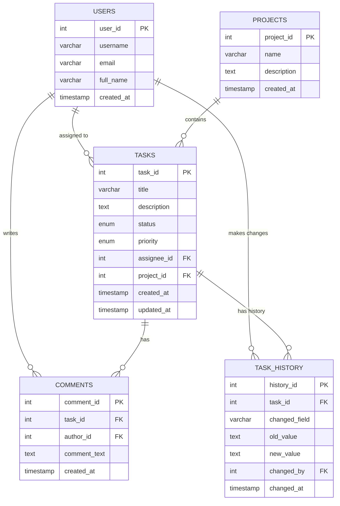

```mermaid
erDiagram
    USERS {
        int user_id PK
        varchar username
        varchar email
        varchar full_name
        timestamp created_at
    }
    
    PROJECTS {
        int project_id PK
        varchar name
        text description
        timestamp created_at
    }
    
    TASKS {
        int task_id PK
        varchar title
        text description
        enum status
        enum priority
        int assignee_id FK
        int project_id FK
        timestamp created_at
        timestamp updated_at
    }
    
    COMMENTS {
        int comment_id PK
        int task_id FK
        int author_id FK
        text comment_text
        timestamp created_at
    }
    
    TASK_HISTORY {
        int history_id PK
        int task_id FK
        varchar changed_field
        text old_value
        text new_value
        int changed_by FK
        timestamp changed_at
    }

    USERS ||--o{ TASKS : "assigned to"
    USERS ||--o{ COMMENTS : "writes"
    USERS ||--o{ TASK_HISTORY : "makes changes"
    PROJECTS ||--o{ TASKS : "contains"
    TASKS ||--o{ COMMENTS : "has"
    TASKS ||--o{ TASK_HISTORY : "has history"
```