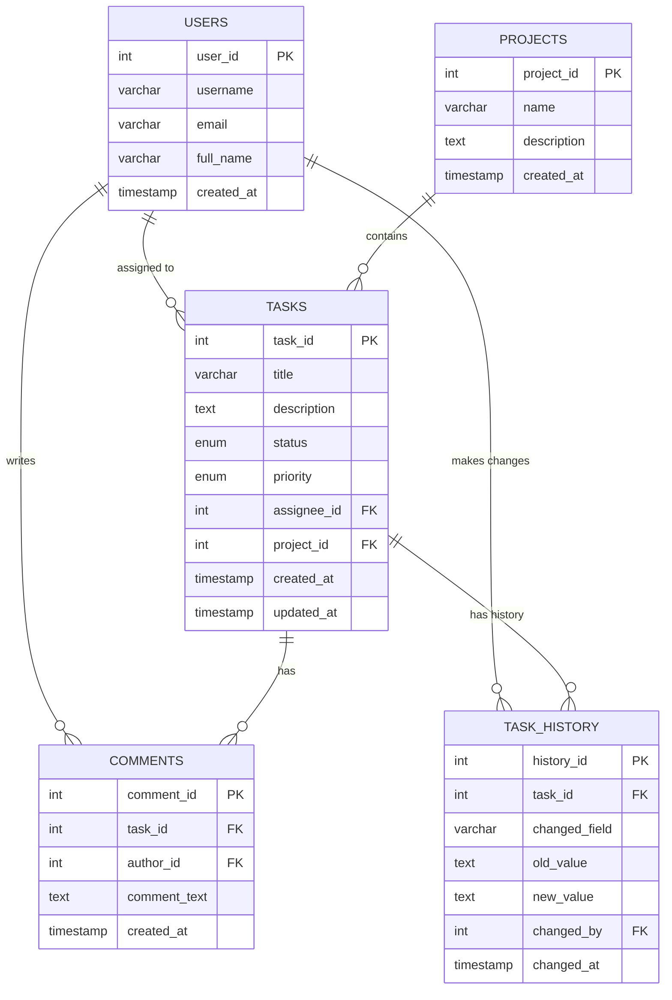

# Task Tracker System - Database Project

Этот проект представляет собой реляционную модель базы данных для системы управления задачами (Task Tracker). Реализация включает полный аудит изменений задач (версионирование) с помощью триггеров и набор аналитических запросов для извлечения полезной метрик.

## 🗃️ О проекте

Цель проекта — продемонстрировать навыки:
- Проектирования БД (концептуальная, логическая, физическая модели)
- Реализации сложных механизмов (триггеры для аудита изменений)
- Написания продвинутых аналитических SQL-запросов
- Организации кода и документации

## 📊 Модель данных

ER-диаграмма, отображающая сущности и их связи:



**Описание основных таблиц:**
- `users` - Пользователи системы
- `projects` - Проекты
- `tasks` - Задачи (основная сущность)
- `comments` - Комментарии к задачам
- `task_history` - Таблица для хранения истории изменений атрибутов каждой задачи (аудит)

## 🚀 Технологии

- **MySQL** 8.0+ (код может быть адаптирован для PostgreSQL)
- Триггеры для реализации версионирования
- Индексы для оптимизации производительности
- Mermaid.js для визуализации ER-диаграмм

## ⚙️ Установка и настройка

1.  **Убедитесь, что у вас установлен MySQL Server 8.0+**

2.  **Клонируйте репозиторий:**
    ```bash
    git clone https://github.com/your-username/task-tracker-system.git
    cd task-tracker-system
    ```

3.  **Подключитесь к MySQL:**
    ```bash
    mysql -u your_username -p
    ```

4.  **Выполните SQL-скрипты в порядке:**
    ```sql
    SOURCE database/01_schema_creation.sql;
    SOURCE database/02_sample_data.sql;
    ```

## 📝 Примеры использования

После наполнения базы данными вы можете выполнять аналитические запросы из файла `03_analytical_queries.sql`.

**Например, чтобы получить полную историю изменений задачи:**
```sql
SELECT * FROM task_history WHERE task_id = 1 ORDER BY changed_at DESC;
```

## 🔍 Аналитические возможности

Проект включает запросы для:
- Отслеживания времени выполнения задач
- Анализа активности пользователей
- Распределения задач по статусам и приоритетам
- Выявления наиболее комментируемых задач
- Построения временной линии активности

## 📁 Структура проекта

```
task-tracker-system/
├── database/
│   ├── 01_schema_creation.sql    # Создание структуры БД
│   ├── 02_sample_data.sql        # Примеры данных
│   └── 03_analytical_queries.sql # Аналитические запросы
└── README.md                     # Этот файл
```

